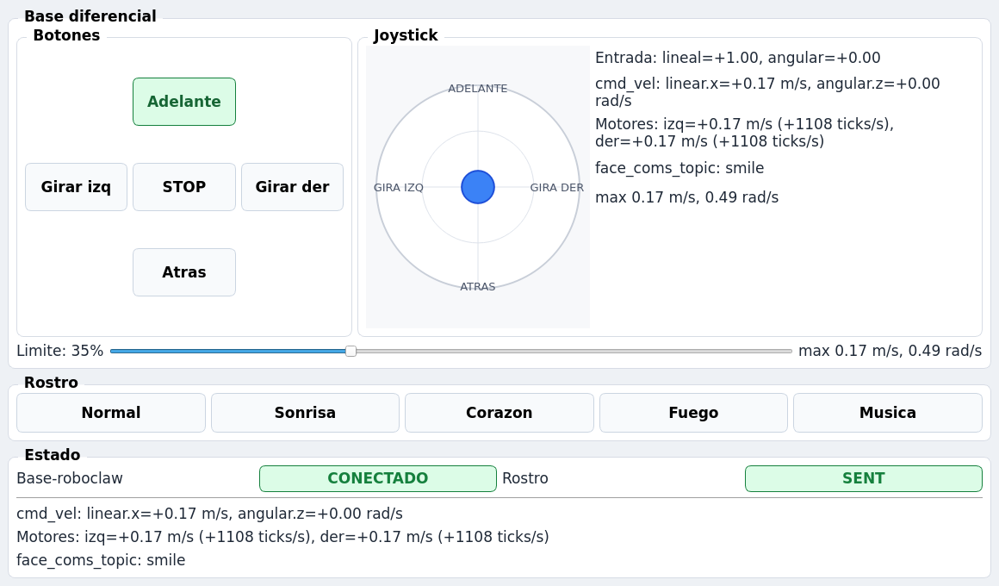
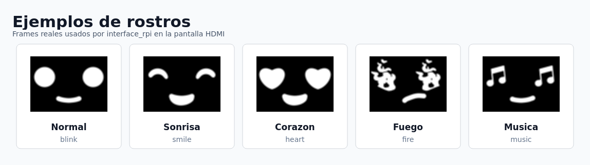

# caterpillar_robot_mkt

Robot movil diferencial con RoboClaw y pantalla HDMI para rostros animados.

Desarrollado para un proyecto de la Universidad de Ingenieria y Tecnologia
(UTEC), Departamento de Mecatronica. Codigo desarrollado por Marko Puchuri.

```text
interface_pc -> cmd_vel -> roboclaw_node -> RoboClaw
interface_pc -> face_coms_topic -> interface_rpi -> pantalla HDMI
```

## Vista General



La interfaz mueve la base diferencial, limita velocidad, detiene el robot y
envia rostros a la pantalla.



## Instalacion

```bash
chmod +x install_raspberry.sh
./install_raspberry.sh
source install/setup.bash
```

Si el usuario fue agregado a `dialout`, reinicia sesion antes de usar
`/dev/ttyACM0`.

## Ejecucion

Robot en Raspberry:

```bash
ros2 launch roboclaw_ros2 mobile_robot.launch.py port:=/dev/ttyACM0
```

Interfaz de control:

```bash
ros2 run interface_pc interface_pc
```

Robot e interfaz en la misma Raspberry:

```bash
ros2 launch roboclaw_ros2 mobile_robot.launch.py start_control_gui:=true
```

## Paquetes

| Paquete | Funcion | README |
| --- | --- | --- |
| `interface_pc` | GUI para movimiento y rostros. | [`interface_pc/README.md`](interface_pc/README.md) |
| `interface_rpi` | Pantalla HDMI de rostros. | [`interface_rpi/README.md`](interface_rpi/README.md) |
| `roboclaw_ros2` | Puente `cmd_vel` a RoboClaw. | [`roboclaw_ros2/readme.md`](roboclaw_ros2/readme.md) |

## Topics Principales

| Topic | Tipo | Uso |
| --- | --- | --- |
| `cmd_vel` | `geometry_msgs/msg/Twist` | Movimiento diferencial. |
| `face_coms_topic` | `std_msgs/msg/String` | Seleccion de rostro. |
| `roboclaw/cmd_ticks/left` | `std_msgs/msg/Int32` | Diagnostico ticks lado izquierdo. |
| `roboclaw/cmd_ticks/right` | `std_msgs/msg/Int32` | Diagnostico ticks lado derecho. |

## Pruebas Rapidas

Mover:

```bash
ros2 topic pub --once /cmd_vel geometry_msgs/msg/Twist "{linear: {x: 0.15}, angular: {z: 0.0}}"
```

Detener:

```bash
ros2 topic pub --once /cmd_vel geometry_msgs/msg/Twist "{linear: {x: 0.0}, angular: {z: 0.0}}"
```

Rostro:

```bash
ros2 topic pub --once /face_coms_topic std_msgs/msg/String "{data: 'music'}"
```
